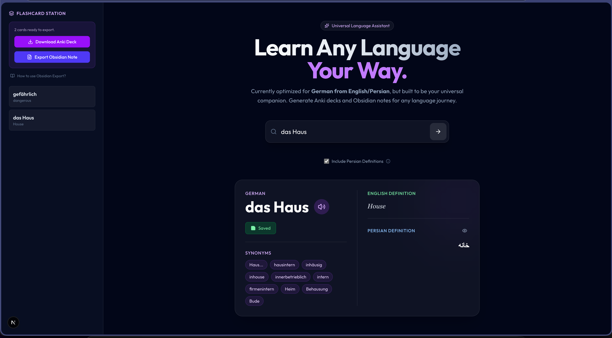

# 🌐 Universal Language App (Project A.E.L.L.A.)

> **A.E.L.L.A.** — *All Encapsulated Language Learning Assistant* (or *Abbas Endari Language Learning Assistant😉*)




A scalable, comprehensive language learning companion designed to be your **Personal Language Pal**. 

**Current Focus**: 🇩🇪 **German** learning for native 🇬🇧 **English** and 🇮🇷 **Persian** speakers.

Built to assist with vocabulary acquisition, pronunciation mastery, and knowledge retention through seamless integration with powerful tools like **Anki** and **Obsidian**.

## 📑 Table of Contents
- [✨ Features](#-features-planned--in-progress)
- [🛠️ Tech Stack](#️-tech-stack)
- [📦 Installation Guide](#-installation-guide)
- [🔮 Future Roadmap](#-future-roadmap)
- [📄 License](#-license)

---

## ✨ Features (Planned & In-Progress)

- 🗣️ **Instant Pronunciation**: High-quality audio fetching for words you learn.
- 📖 **Smart Definitions**: Auto-retrieval of definitions, cleaning out noise.
- 🧠 **Space Repetition Ready**: Auto-generate formatted **Anki** flashcards.
- 📝 **Knowledge Graph**: Export entries to **Obsidian** markdown with rich metadata.
- 🚀 **Offline Capable**: Designed to run locally on your Mac/PC.

---

## 🛠️ Tech Stack

### Frontend
- **Framework**: [Next.js](https://nextjs.org/) (React)
- **Styling**: Vanilla CSS / Modules (Premium Aesthetic)
- **Deployment**: Static Export (GitHub Pages compatible)

### Backend
- **Framework**: [FastAPI](https://fastapi.tiangolo.com/) (Python)
- **Concurrency**: Fully Async fetching
- **Hosting**: PythonAnywhere compatible

---

## 📦 Installation Guide

> [!NOTE] 
> **Ease of Access Upcoming**: 
> We are planning to release a **Docker** container and a **Standalone Desktop App** (executable) in the future, so you won't need to set up the dev environment manually!

### 1. Backend Setup (API)
Ensure you have **Python 3.10+** installed.

```bash
cd backend
python -m venv .venv
source .venv/bin/activate  # On Windows: .venv\Scripts\activate
pip install -r requirements.txt
uvicorn main:app --reload
```

### 2. Frontend Setup (UI)
Ensure you have **Node.js 18+** installed.

```bash
cd frontend
npm install
npm run dev
```

Visit `http://localhost:3000` to start learning!

---

## 🔮 Future Roadmap

- [ ] **Electron Integration**: Bundle as a standalone desktop executable.
- [ ] **Flashcard Generator**: One-click `.apkg` export.
- [ ] **Polyglot Mode**: Support for multi-language dictionaries.
- [ ] **AI Context**: LLM-powered sentence generation for vocab words.

---

## 📄 License

This project is licensed under the MIT License - see the [LICENSE](LICENSE) file for details.

---

<p align="center">
  Built with ❤️ by <strong>Abbas Endari</strong>
</p>
