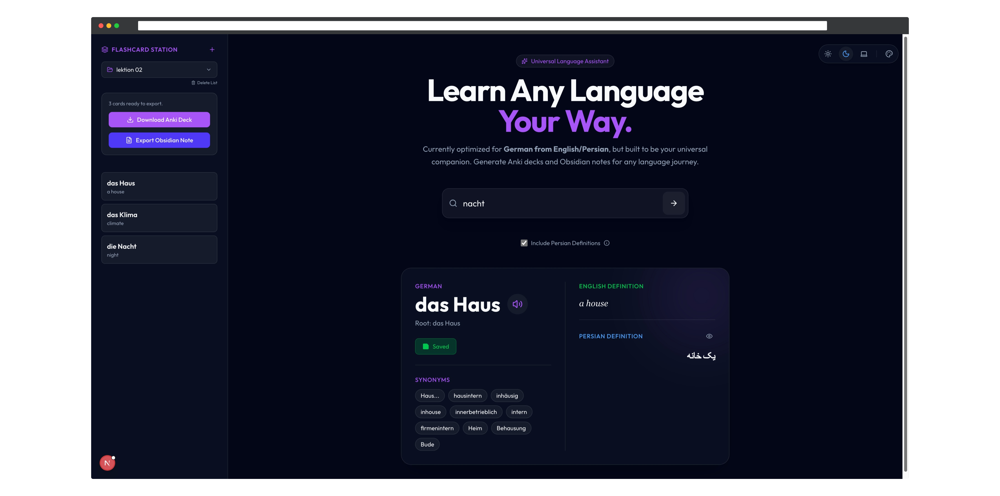
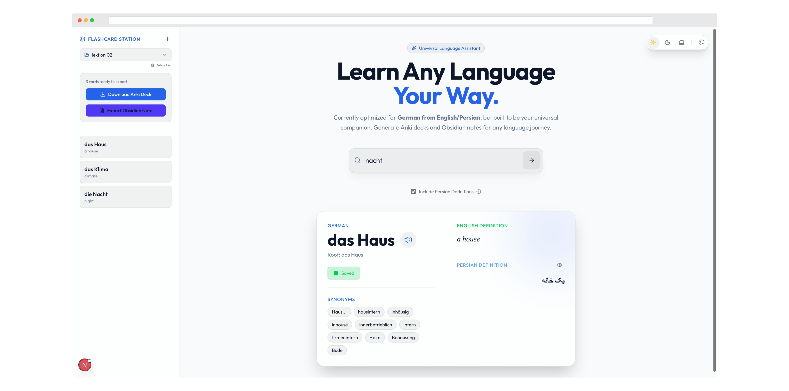
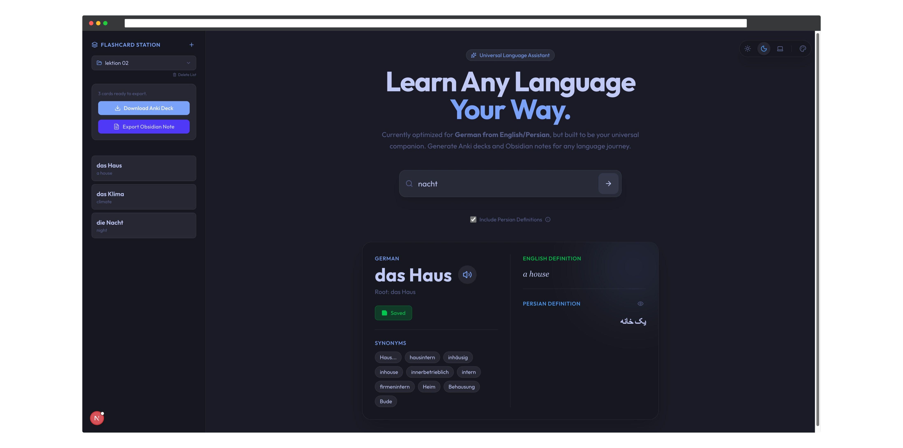
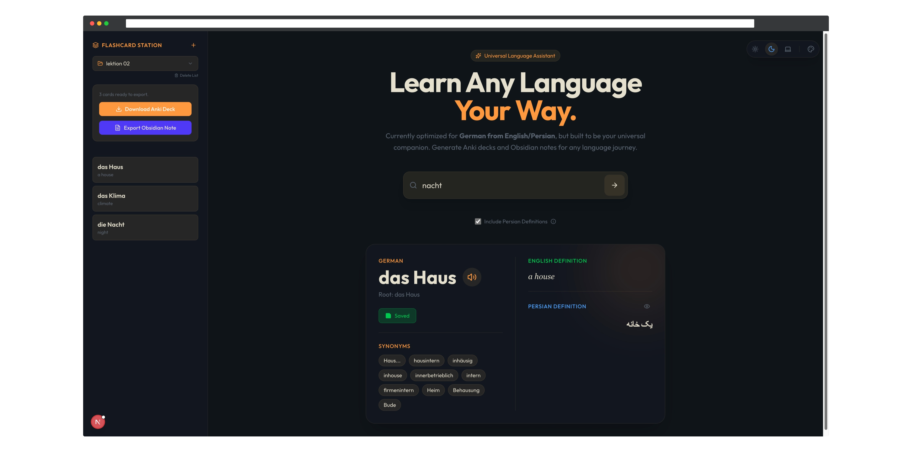

# 🌐 Universal Language App (Project A.E.L.L.A.)

> **A.E.L.L.A.** — *All Encapsulated Language Learning Assistant* (or *Abbas Endari Language Learning Assistant😉*)


### 🎨 Theme Showcase

**Midnight Theme (Default)**


<details>
<summary>📸 View More Themes</summary>

**Paper Theme**


**Tokyo Night Theme**


**Ayu Mirage Theme**


</details>

---

A scalable, comprehensive language learning companion designed to be your **Personal Language Pal**. 

Built to assist with vocabulary acquisition, pronunciation mastery, and knowledge retention through seamless integration with powerful tools like **Anki** and **Obsidian**.

## 📑 Table of Contents
- [✨ Features](#-features-planned--in-progress)
- [🛠️ Tech Stack](#️-tech-stack)
- [📦 Installation Guide](#-installation-guide)
- [🔮 Future Roadmap](#-future-roadmap)
- [📄 License](#-license)

## 📚 Documentation

| Document | Description |
|----------|-------------|
| [📦 Installation Guide](docs/INSTALLATION.md) | Complete setup instructions |
| [📖 Usage Guide](docs/USAGE.md) | How to use all features |
| [🐳 Docker Guide](docs/DOCKER.md) | Docker configuration & troubleshooting |
| [🤝 Contributing](docs/CONTRIBUTING.md) | How to contribute |
| [🏗️ Architecture](docs/ARCHITECTURE.md) | Technical overview |

---

## ✨ Features (Planned & In-Progress)

- 🗣️ **Instant Pronunciation**: High-quality audio fetching for words you learn.
- 📖 **Smart Definitions**: Auto-retrieval of definitions, cleaning out noise.
- 🧠 **Space Repetition Ready**: Auto-generate formatted **Anki** flashcards.
- 📝 **Knowledge Graph**: Export entries to **Obsidian** markdown with rich metadata.
- 🚀 **Offline Capable**: Designed to run locally on your Mac/PC.

---

## 🛠️ Tech Stack

### Frontend
- **Framework**: [Next.js](https://nextjs.org/) (React)
- **Styling**: Vanilla CSS / Modules (Premium Aesthetic)
- **Deployment**: Static Export (GitHub Pages compatible)

### Backend
- **Framework**: [FastAPI](https://fastapi.tiangolo.com/) (Python)
- **Concurrency**: Fully Async fetching
- **Hosting**: PythonAnywhere compatible

---

## 📦 Installation Guide

### Quick Start with Docker (Recommended)
With Docker, you can run the entire application with a single command, without needing to install Python or Node.js on your machine.

1.  **Install Docker**: Make sure you have [Docker](https://docs.docker.com/get-docker/) installed and running on your system.

2.  **Run the application**:
    ```bash
    docker-compose up --build
    ```

    This will build the frontend and backend images and start the containers.

    - The frontend will be available at `http://localhost:3000`
    - The backend API will be running at `http://localhost:8000`

📖 **For detailed Docker instructions, troubleshooting, and advanced usage, see [Docker Guide](docs/DOCKER.md)**

### Automated Setup (Scripts)

We provide helper scripts to set up the environment automatically.

**Mac / Linux:**
```bash
chmod +x setup_mac_linux.sh
./setup_mac_linux.sh
```

**Windows:**
```batch
./setup_windows.bat
```

### Manual Setup

> [!NOTE]
> If the scripts fail or you prefer manual control:

### 1. Backend Setup (API)
Ensure you have **Python 3.10+** installed.

```bash
cd backend
python -m venv .venv
source .venv/bin/activate  # On Windows: .venv\Scripts\activate
pip install -r requirements.txt
uvicorn main:app --reload
```

### 2. Frontend Setup (UI)
Ensure you have **Node.js 18+** installed.

```bash
cd frontend
npm install
npm run dev
```

Visit `http://localhost:3000` to start learning!

---

## 🔮 Future Roadmap

- [ ] **Electron Integration**: Bundle as a standalone desktop executable.
- [x] **Polyglot Mode**: Support for multi-language dictionaries.
- [ ] **AI Context**: LLM-powered sentence generation for vocab words.

---

## 📄 License

This project is licensed under the MIT License - see the [LICENSE](LICENSE) file for details.

---

## 🙏 Acknowledgments & Third-Party Credits

A.E.L.L.A. integrates with and is inspired by the following amazing projects:

| Project | Description | License |
|---------|-------------|---------|
| [**Anki**](https://apps.ankiweb.net/) | Powerful, intelligent flashcard program | [AGPL-3.0](https://github.com/ankitects/anki/blob/main/LICENSE) |
| [**Obsidian**](https://obsidian.md/) | Private, flexible note-taking app | Proprietary (free for personal use) |
| [**Google Translate**](https://translate.google.com/) | Translation and definition service | Google Terms of Service |
| [**FastAPI**](https://fastapi.tiangolo.com/) | Modern Python web framework | [MIT](https://github.com/tiangolo/fastapi/blob/master/LICENSE) |
| [**Next.js**](https://nextjs.org/) | React framework for the web | [MIT](https://github.com/vercel/next.js/blob/canary/license.md) |
| [**Microsoft Edge TTS**](https://github.com/rany2/edge-tts) | Text-to-speech via Edge | [GPL-3.0](https://github.com/rany2/edge-tts/blob/master/LICENSE) |

> **Note**: Anki® and Obsidian® are registered trademarks of their respective owners. A.E.L.L.A. is an independent project and is not affiliated with, endorsed by, or sponsored by Anki or Obsidian.

---

<p align="center">
  Built with ❤️ by <strong>Abbas Endari</strong>
</p>
